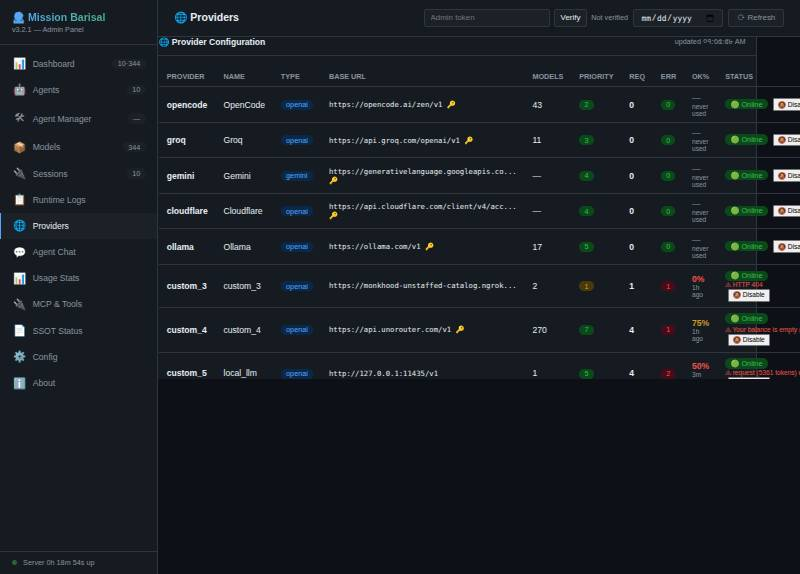

# Mission Barisal (VMAMA) — Monu The Builder

Local-first AI co-pilot stack: a zero-dependency Node.js gateway (`api.js`), an MCP
tool bus (35 tools, 4 transports), a browser admin panel, DB-backed telemetry, and an
optional local LLM bridge that serves a CPU-run llama.cpp model over a Unix socket.

> Everything below was verified on this machine (Linux, Node 18+,4-core CPU,15 GB RAM)
> on 2026-09-26. Screenshots and response excerpts live in [`docs/evidence/`](docs/evidence/).
> Where something was not proven, it is called out under **Limitations** — nothing is padded.

---

## Quick start

```bash
# Gateway (UI :3000, plus3100/3101/3102, broker9998)
node start.js --start-all

# Optional: local LLM bridge (llama.cpp behind an OpenAI-compatible socket)
node local-llm-bridge.js
```

- Admin panel: `http://localhost:3000/admin.html`
- OpenAI-compatible API: `http://localhost:3000/v1`
- MCP endpoint (for VS Code / any MCP client): `http://localhost:3000/mcp`
- Bridge health: `curl http://127.0.0.1:11435/health`

Secrets (`.env`, provider keys), the live DB (`data/`), logs (`logs/`) and `*.db` are
git-ignored; the only binary committed on purpose is the seed snapshot `registry.db`
(see Repository hygiene).

---

## MCP Tools (35)

Verified live via `GET /api/admin/tools` — count **35**, all enabled at capture time,
**9 lifetime tool calls,0 tool errors** (admin screenshot below).

| # | Tool | Purpose |
|---|------|---------|
|1|`agent_mission`|Execute a mission with all agents in parallel |
|2|`agent_single`|Execute with a single agent |
|3|`browse_cdp`|Headless-browse a URL via Chrome DevTools Protocol over a PIPE (zero HTTP control channel) |
|4|`call_agent`|Call another agent for a specific sub-task |
|5|`db_list_tables`|List tables in the configured database (MySQL/SQLite/PostgreSQL) |
|6|`db_query`|Run a SQL query against a configured database |
|7|`delete_file`|Delete a file or directory (recursive for directories) |
|8|`env_get`|Read an environment variable by name |
|9|`exec`|Run a shell command cross-platform in any folder |
|10|`get_memory`|Retrieve session memory |
|11|`get_working_dir`|Get current MCP working directory |
|12|`glob`|Find files by glob pattern inside the MCP working dir |
|13|`grep`|Search file contents with a regex or plain text pattern |
|14|`http_request`|Make an HTTP request (GET/POST/PUT/PATCH/DELETE) using Node built-ins |
|15|`list_directory`|List contents of a directory |
|16|`ocr__ocr_crop`| `[external:ocr]` Crop a region from an image and extract text |
|17|`ocr__ocr_image`| `[external:ocr]` Extract text from an image file (PNG/JPG/BMP/TIFF/PDF) |
|18|`ocr__ocr_screenshot`| `[external:ocr]` Screenshot the screen and extract text via OCR |
|19|`open_browser`|Open a file or URL in the default browser |
|20|`read_file`|Read a file from the filesystem |
|21|`read_ssot`|Read the current SSOT |
|22|`remote_mcp_call`|Call a tool on a remote MCP server (outbound MCP client) |
|23|`rename_file`|Rename or move a file/directory |
|24|`screen-recorder__screen_record_start`| `[external:screen-recorder]` Start recording the screen |
|25|`screen-recorder__screen_record_status`| `[external:screen-recorder]` Check if a recording is active |
|26|`screen-recorder__screen_record_stop`| `[external:screen-recorder]` Stop the active recording |
|27|`screen-recorder__screen_screenshot`| `[external:screen-recorder]` Screenshot of the entire screen |
|28|`set_working_dir`|Set MCP working directory for relative file paths |
|29|`system_info`|Cross-platform system info (platform, arch, OS, hostname, Node, memory) |
|30|`terminal`|Run a shell command in the server terminal |
|31|`tts__tts_play`| `[external:tts]` Convert text to speech AND play it immediately |
|32|`tts__tts_speak`| `[external:tts]` Convert text to speech audio file |
|33|`tts__tts_voices`| `[external:tts]` List available TTS voices |
|34|`web_search`|Search the web for real-time information |
|35|`write_file`|Write content to a file (creates directories) |

Tools can be switched off per-tool from **Admin → MCP & Tools**; enforcement happens at
one choke point (`executeMcpTool` refuses disabled tools) and `tools/list` filters them
out for every transport. Verified live: disabling `system_info` dropped `tools/list`
from35 to34 and direct calls returned a refusal; re-enabling restored it.


---

## Agents (9 core +1 demo)

Live from `GET /api/admin/stats` (models as mapped on this machine):

| ID | Name | Role | Mapped model |
|----|------|------|--------------|
|`doc-king`|Documentation King - Halim|documentation|`mistral-small:free`|
|`team-heart`|Team Heart - Jara|general|`mistral/leanstral-1-5`|
|`customer-experience-specialist`|Customer Experience Specialist|customer-experience|`gpt-oss:120b`|
|`ecommerce-operations-analyst`|E-Commerce Operations Analyst|ecommerce-operations|`qwen3:free`|
|`bug-hunter`|Bug Hunter - Jewel|debugging|`llama3.1:8b`|
|`code-guru`|Code Guru - Monu|architecture|`qwen3.8-27b:free`|
|`perf-wizard`|Performance Wizard - Rashed|performance|`nemotron-3-nano:30b`|
|`qa-tyrant`|Quality Tyrant - Mojnu|quality|`glm-4.7-flash:free`|
|`security-hero`|Security Hero - Bablu|security|`north-mini-code:free`|
|`llama-local-test`|Llama Local Test *(demo, priority99)*|test harness|`llama-local` (local bridge)|

Agents are created/edited/enabled from **Admin → Agent Manager**; each agent card shows
`Current Model` plus a `Change Model` dropdown populated from the model DB, with `Save`.


Calling an agent through the OpenAI-compatible API is just `model = agent id`:

```json
POST /v1/chat/completions
{ "model": "llama-local-test", "messages": [...] }
→ resolves agent → agent.model (llama-local) → provider custom_5 → local Unix socket
```

---

## Transports

| Transport | Endpoint | Notes |
|-----------|----------|-------|
| HTTP JSON-RPC2.0 | `POST /mcp` | Main MCP entry; also used by VS Code (`http://localhost:3000/mcp`) |
| SSE | `GET /mcp` | Emits `endpoint` event + tools list as server-sent events |
| WebSocket | `ws://…` (HTTP upgrade) | Full-duplex message channel |
| Unix domain socket | `/tmp/zombiecoder/mcp.sock` | newline-delimited JSON-RPC; TCP fallback on Windows |
| OpenAI-compatible HTTP | `/v1/chat/completions`, `/v1/models` | Chat + discovery for any OpenAI SDK client |

`tools/list` and `tools/call` behave identically across all of them (same MCP_TOOLS
registry, same enable/disable filter). The local LLM bridge adds a *provider-side*
transport (see next section): the gateway reaches it over `/tmp/local-llm.sock`.

---

## Endpoints (HTTP surface)

Route index maintained in the `api.js` header. Highlights:

**Core / discovery**
`GET /` (UI dashboard) · `GET /health` · `GET /identity` · `GET /v1/models` (agent ids +
`mission`) · `GET /api/v0/models` (real provider models, for IDEs) · `GET /api/v1/models`
(model DB,344 models at capture) · `GET /api/mcp-clients` · `GET /api/clients` ·
`GET /api/domain` · `GET /api/pusher-config` · `GET /api/rate-limit` +
`POST /api/rate-limit/reset` · `GET /api/locks`

**Chat / execution**
`POST /v1/chat/completions` (OpenAI-compatible, streaming or not) · `POST /api/mission`
(multi-agent) · `POST /api/input` (unified HTTP entry) · `POST /api/normalize` ·
WebSocket upgrade handler

**MCP**
`POST /mcp` (JSON-RPC2.0) · `GET /mcp` (SSE) · UDS `/tmp/zombiecoder/mcp.sock`

**Anti-dote**
`POST /api/v1/anti-dote`

**Admin / telemetry**
`GET /api/admin` (HTML) · `GET /api/admin/stats` (includes usage telemetry spread) ·
`GET /api/admin/providers` (enriched: req/err/OK%/last-used/last-error/health) ·
`GET /api/admin/session-log` (sessions + lifetime `agent_calls`) ·
`GET|POST /api/admin/tools` (list + per-tool on/off) ·
`GET|POST /api/admin/agents`, `DELETE /api/admin/agents/{id}` ·
`GET /api/agents` · `GET /api/agents-status`

**State / config**
`GET|POST /api/config` (runtime config, persisted to the `settings` table) ·
`GET /api/ssot` · `GET /api/sessions` + `GET /api/sessions/{id}` ·
`POST /api/set-working-dir` · `POST /api/workspace` · `POST /api/syllabus` ·
`GET /api/admin` panel + static `admin.html`

---

## Anti-dote

A6-step chain (`api.js`, section "Anti-dote") runs on **all** execution endpoints:
`/v1/chat/completions`, `/api/mission`, MCP, and `POST /api/v1/anti-dote` itself.
Behavior is **monitoring mode by design**: if the anti-dote chain fails, execution
still proceeds and the failure is recorded — it never blocks a request. Togglable at
runtime via `ANTIDOTE_ENABLED` / runtime config (`antiDoteEnabled`).

---

## Local LLM bridge (`local-llm-bridge.js`)

One small standalone script so that every llama.cpp / Ollama quirk stays **out** of the
main gateway: the bridge speaks clean OpenAI dialect to any client (no auth header
required) and absorbs local-model weirdness itself.

```
 any client                 Unix socket IPC            loopback only
┌────────────┐  /tmp/local-llm.sock   ┌─────────────────┐   :18777   ┌─────────────┐
│ gateway    │ ─────────────────────▶ │ local-llm-      │ ──────────▶ │ llama-server│
│ (api.js)   │  or127.0.0.1:11435/v1  │ bridge.js       │            │ (llama.cpp) │
│ CUSTOM_    │ ◀───────────────────── │ quirk layer Q1- │ ◀────────── │ Llama-3.2-1B│
│ PROVIDER_5 │                        │ Q10             │             │ Q8_0 GGUF   │
└────────────┘                        └─────────────────┘             └─────────────┘
```

**Served routes:** `GET /health` · `GET /v1/models` · `POST /v1/chat/completions`
(stream + non-stream) — on **both** transports simultaneously
(`unix:///tmp/local-llm.sock`, perm `0666`, and `http://127.0.0.1:11435`).

**Quirk layer (all inside this one file):**

| # | Quirk absorbed |
|---|----------------|
| Q1 | No auth required — Authorization header accepted but never needed (CORS `*`) |
| Q2 | Model aliasing — any caller model name is answered by the configured GGUF; response echoes the caller's name |
| Q3 | Reasoning-tag stripping — `<|think|>`-style markers removed from `content` (kept in `reasoning_content`), on non-stream **and** stream via a holdback scanner that survives markers split across SSE chunks |
| Q4 | Text tool-call formats (function-call block, fenced JSON `{name,arguments}`, function-prefix JSON) converted to real OpenAI `tool_calls` + `finish_reason:"tool_calls"` |
| Q5 | Empty reply while tools were sent → one automatic retry without tools |
| Q6 | Backend rejects the tools block (template/grammar/PEG errors) → one retry with a JSON-tool hint system containing the full tool spec |
| Q7 | `response_format: json_object` → first balanced JSON value extracted from prose |
| Q8 | Missing `usage` → estimated and flagged `usage.estimated: true` (never passed off as exact) |
| Q9 | Stream normalization — `id`/`created`/`model` stamped on every chunk, guaranteed `data: [DONE]`, `: hb` heartbeat every15 s (kills idle-timeouts on slow CPU inference) |
| Q10 | Body parsed regardless of `Content-Type`; friendly JSON errors instead of upstream HTML |

**Configuration** (env, defaults fit this machine):

| Env | Default | Meaning |
|-----|---------|---------|
| `BRIDGE_BACKEND` | `auto` | `auto` = llama if binary+GGUF found, else ollama |
| `LLAMA_SERVER_BIN` | auto-detected | llama.cpp server binary (found `…/llama-b11146/llama-server`, v0.5.0-dev) |
| `BRIDGE_GGUF` | auto-detected | `~/.local/share/models/Llama-3.2-1B-Instruct-Q8_0.gguf` (1,321,083,008 bytes) |
| `BRIDGE_MODEL` | `llama-local` | wire model name |
| `BRIDGE_PORT` | `11435` | loopback TCP |
| `BRIDGE_SOCKET` | `/tmp/local-llm.sock` | Unix socket |
| `BRIDGE_INTERNAL_PORT` | `18777` | llama-server loopback (never exposed beyond127.0.0.1) |
| `BRIDGE_CTX` | `16384` | context (gateway prompts measure ~6.2 k tokens;4096 was too small — see Limitations) |
| `BRIDGE_THREADS` | CPU count | llama-server threads |
| `BRIDGE_TIMEOUT_MS` | `280000` | upstream timeout |
| `BRIDGE_OLLAMA_URL` | `http://127.0.0.1:11434` | used only in ollama backend mode |

Any other GGUF ≤ ~2 GB drops in via `BRIDGE_GGUF` (a cached
`Qwen3.5-0.8B-Q8_0.gguf` is also auto-detected as fallback). The bridge spawns and
supervises llama-server itself (auto-respawn, `cache_prompt:true` so repeated gateway
context skips re-prefill), and unlinks the socket on Ctrl-C.

**Gateway wiring** (`.env`, git-ignored):

```
CUSTOM_PROVIDER_5_NAME=local_llm
CUSTOM_PROVIDER_5_URL=http://127.0.0.1:11435/v1
CUSTOM_PROVIDER_5_SOCKET=/tmp/local-llm.sock     # api.js prefers UDS when the file exists
CUSTOM_PROVIDER_5_MODELS=llama-local
```

---

## Evidence

All from this machine, same day. Short excerpts only; full outputs in the session log
(`logs/2026-09-26.log`, gateway log, `/tmp/opencode/bridge.log`).

**1. Bridge up, both transports, no auth**

```json
GET http://127.0.0.1:11435/health
{"status":"ok","bridge":"local-llm-bridge","backend":"llama","model":"llama-local",
 "gguf":"Llama-3.2-1B-Instruct-Q8_0.gguf","upstream":{"base":"http://127.0.0.1:18777","ready":true},
 "transports":{"unix_socket":"/tmp/local-llm.sock","tcp":"127.0.0.1:11435"},"auth_required":false}
```

**2. Any model name works (aliasing), plain curl, no Authorization header**

```json
{"id":"chatcmpl-8IA59dA5PY…","model":"whatever-name",
 "choices":[{"message":{"role":"assistant","content":"BARISAL-OK"},"finish_reason":"stop"}]}
```

**3. Tool call end-to-end through the bridge (Q6 retry + Q4 parse)**

```json
{"model":"llama-local","choices":[{"message":{"role":"assistant","content":"",
 "tool_calls":[{"id":"call_7e5911722c73c05d","type":"function",
 "function":{"name":"get_weather","arguments":"{\"city\":\"Barisal\"}"}}]},
 "finish_reason":"tool_calls"}],"usage":{"prompt_tokens":128,"completion_tokens":15}}
```

**4. Gateway → local socket (log line, gateway side)**

```
01:28:52 [INFO] UDS_OUTBOUND {"provider":"custom_5","socket":"/tmp/local-llm.sock"}
```

**5. Bridge received it over the Unix socket (log line, bridge side)**

```
01:32:16 [bridge:INFO] CHAT_OK {"transport":"uds","model":"llama-local","stage":"direct",
 "ms":204257,"tools":15,"tool_calls":0,"content_chars":8,"finish":"stop","usage_total":6242}
```

**6. Agent call response (truncated)**

```json
{"id":"chatcmpl-6fe45e90…","model":"llama-local-test",
 "choices":[{"message":{"role":"assistant",
 "content":"ভাইয়া, এই মুহূর্তে আমার কাছে এই তথ্যগুলো নাই। উত্তরটি খুবই সংক্ষিপ্ত।"},
 "finish_reason":"stop"}],
 "agent":{"id":"llama-local-test","name":"Llama Local Test","role":"test harness"}}
```
*(The reply text is the1 B model's own output — kept verbatim, quality and all.)*

**7. Session telemetry row (DB-backed)**

```json
{"agent":"llama-local-test","model":"llama-local","provider":"custom_5",
 "status":"active","requests":6,"user_agent":"curl/8.5.0"}
```

**8. Provider stats row (Admin → Providers)**

```json
{"id":"custom_5","name":"local_llm","baseUrl":"http://127.0.0.1:11435/v1",
 "models":1,"requests":4,"errors":2,"success_pct":50,
 "last_used":"2026-09-26T01:32:16.390Z","healthy":true}
```



**9. Model visible in the model lists**

```
GET /api/v0/models → "id":"llama-local"
GET /api/v1/models → {"id":"llama-local","provider":"custom_5","providerName":"local_llm","free":true}
```

**10. UI console during verification:** `0 errors,0 dropped` (admin panel, all pages visited).

---

## Limitations (stated as-is)

1. **CPU speed is the bottleneck.** Llama-3.2-1B Q8_0 on4 cores: ~30 tok/s prefill,
   ~9 tok/s generation. The gateway injects ~6.2 k tokens of context, so a *cold*
   agent call measured **3 m24 s** end-to-end. `cache_prompt:true` is enabled for
   repeats, but a post-change benchmark has not been run yet — do not read the flag
   as a proven speedup.
2. **The bridge is a separate process.** `start.js --start-all` does not start it;
   run `node local-llm-bridge.js` yourself (documented above). No systemd unit yet.
3. **Tool selection is naive.** Requests are capped at**15 tools** (`sanitizeTools`)
   chosen by slice order, not capability/relevance matching.
4. **No cloud free model in our tests emitted structured `tool_calls`.** That is why
   the local bridge's Q4/Q6 path matters; cloud-side tool-calling remains unproven here.
5. **Mission path gaps (carried over):** the multi-agent `/api/mission` path does not
   wire the `tools` parameter, and its final stream chunk does not carry the
   `swap_notice` note (single-agent paths do).
6. **Pre-existing provider issues, unfixed:** `custom_3` (ngrok tunnel) returns
   HTTP404; Gemini auto-sync hits401; Cloudflare405; `custom_4` balance is empty for
   paid models. The2 errors on `custom_5` were the earlier4096-context failures
   (fixed by `BRIDGE_CTX=16384`) — shown honestly in the provider table instead of
   being reset.
7. **400-class upstream errors are historically labeled `upstream_provider_rate_limit`**
   in telemetry, which is a mislabel (pre-existing, disclosed, not fixed).
8. **Model quality:** a1 B model gives shallow answers (see evidence #6). It proves
   plumbing, not intelligence.
9. **Anti-dote is fail-open by design** (monitoring mode) — it records, never blocks.
10. **Screenshots** were taken at0.55–0.66 page zoom to fit wide tables in one frame.

---

## Repository hygiene

- `.env*` (provider keys, tokens), `data/`, `logs/`, `*.db` are git-ignored —
  `registry.db` is the single deliberate exception (seed snapshot,213 KB).
- No hardcoded API keys in code; code falls back to `""` and the ladder is
  DB → local seed → remote seed download → `registry.db` binary snapshot.
- Diffs are secret-scanned before every push.
- Restart recipe: `node start.js --start-all` from the repo root — it terminates the
  old instance itself (never `pkill -f` with a pattern that also matches your shell).

---

*Built and maintained by Monu (The Builder), Mission Barisal.*
